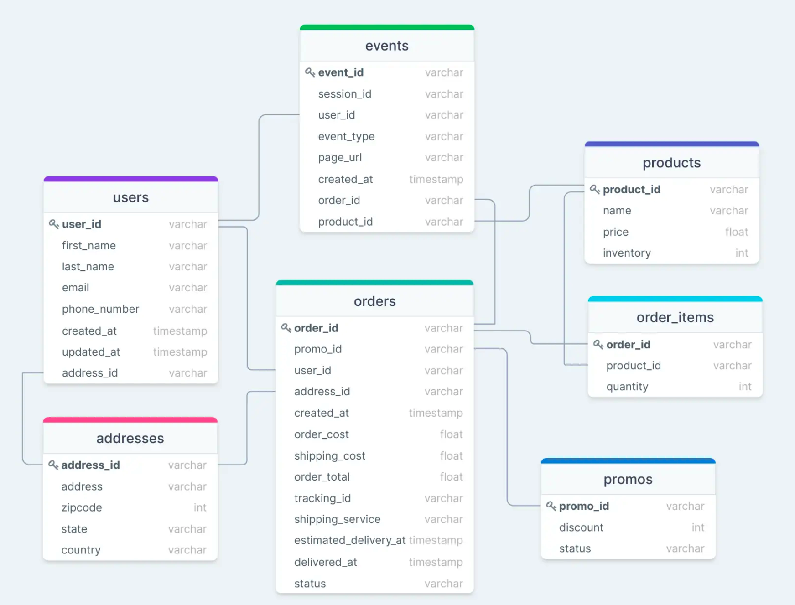
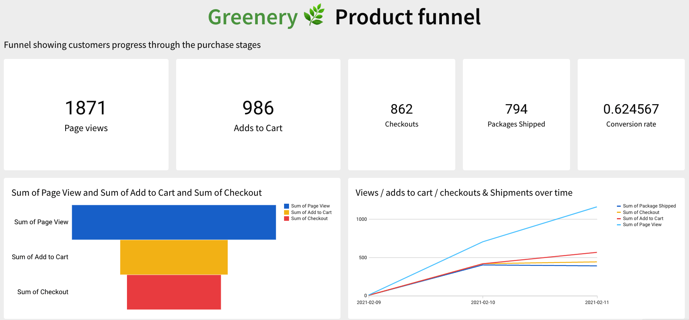
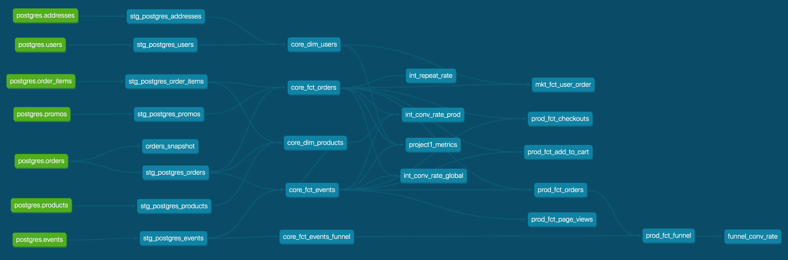

# ANALYTICS ENGINEERING

This project uses DBT to analyse the performance of the Greenery website using their Snowflake database and deploys the dashboard on SigmaComputing.

Technologies used:
- DBT (models, macros, ninjas, exposures, snapshots)
- Snowflake
- Sigmacomputing (dashboard, deployment)

## Greenery database structure

## Product funnel 
This dashboard was generated using Sigmacomputing.com.

## DAG
This is a screenshot of the DAG generated by DBT

## Commands

Use the following commands:
- dbt run
- dbt test

### Resources:
- [docs](https://docs.getdbt.com/docs/introduction)
- [Discourse](https://discourse.getdbt.com/)
- [Slack](https://community.getdbt.com/)
- [dbt events](https://events.getdbt.com)
- [the blog](https://blog.getdbt.com/) 