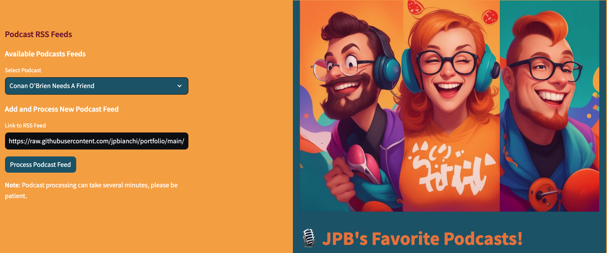
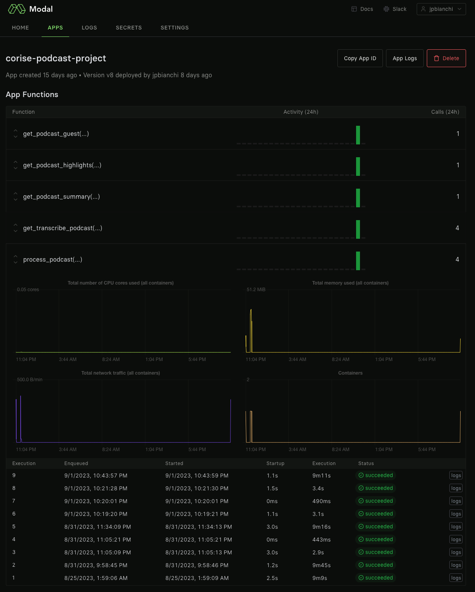
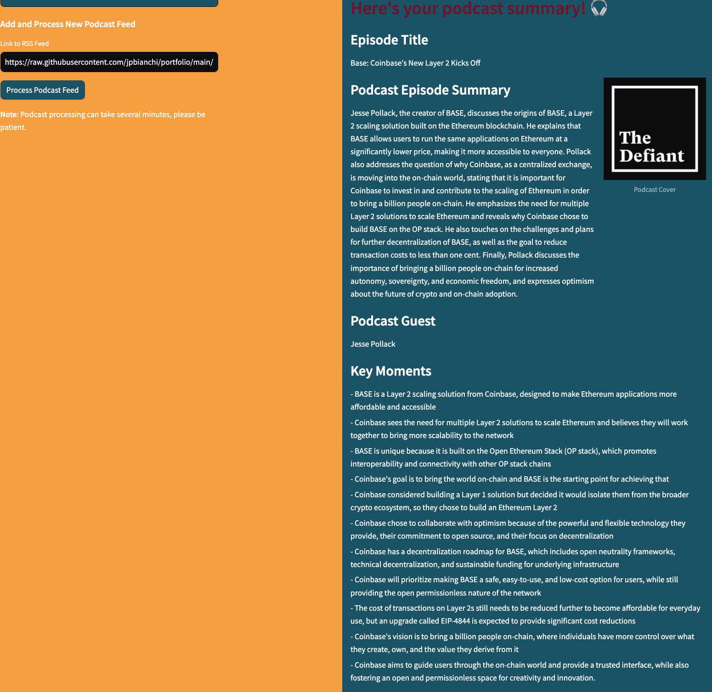

# PODCAST INFO EXTRACTION WITH OPENAI

  

This project shows how to download a podcast from a given RSS link, transcribe it into text, then process it with GPT3.5 to extract various data such as the podcast title, guest name/title/company, highlights and summary.  

It can be used to demonstrate the steps of a typical 'GPT/LLM' application, with different input data.

It was first done in a notebook, then the backend code was upload to a GPU cluster modal.com which greatly facilitates deployment. The frontend was uploaded to streamlit. 

##### Modal provides an easy to use interface to run backend code on a GPU cloud

  

##### Streamlit is an obvious choice to transfer the python frontend code from the notebook 

Here's the result for the Coinbase podcast about their new BASE Layer 2

  

